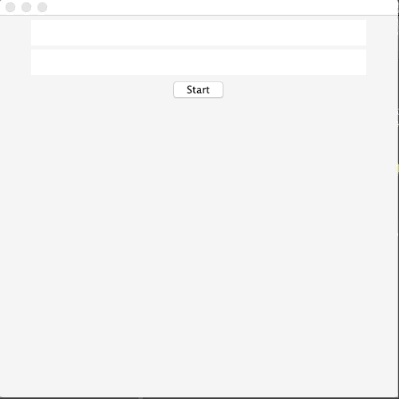

#  
# UDPSocket

### User Stories

The following is an application demonstrating the use of the User Datagram Protocol (UDP). A chatbox can be set up between two devices if they're within the same network. 

### Minimum Viable Product

* Demonstrate understanding of inet addresses, datagram packets, and sockets.

### Approach Taken

* Have initial menu remain present to be able to establish connections with other devices on the same network.
* Established a unicast failsafe in the case that the input is not a valid IP address or a port number 
* Modularized UI components into subclasses so as to seperate network configuration from chat functionality

### Technologies used

* **Swing** To build IO components
* **Net** To implement (built-in) tools vital to datagram transfer
* **Java** To serve as the groundwork for front-end and backend functionality

### Installation Instructions
* Run `SHOW_SOCKET.java` file as a java application
* Open IDE's console for helpful information about your particular device
